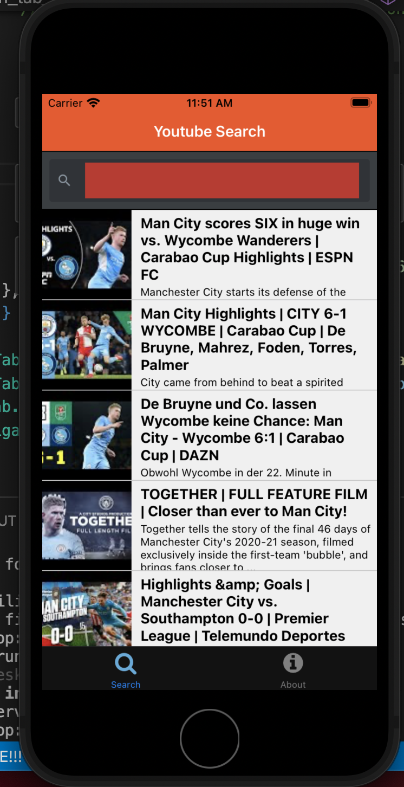
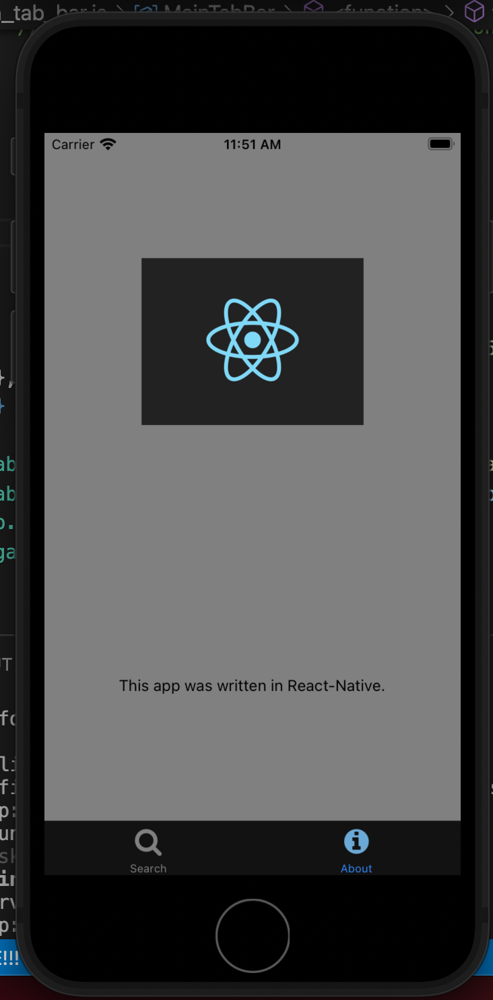
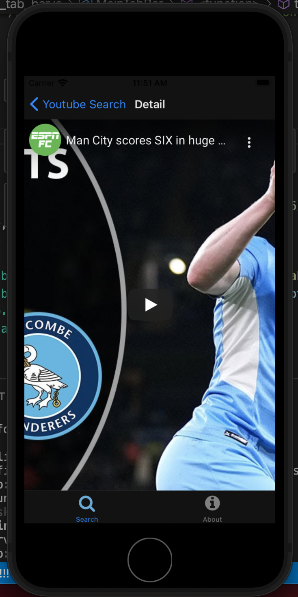
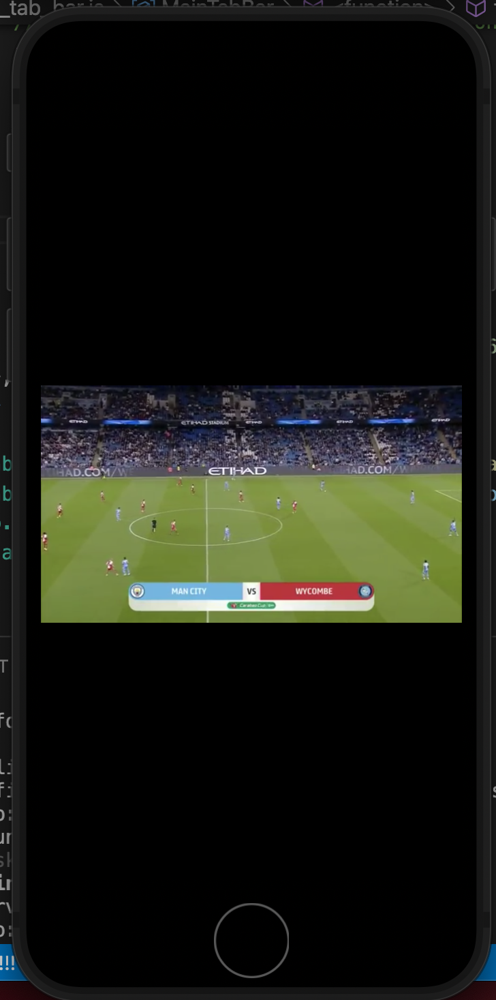

# Hack Technology / Project Attempted

## What you built? 

I built a react app that used a google youtube API to display videos, as well as containing an about tab

Include some screenshots.
[How?](https://help.github.com/articles/about-readmes/#relative-links-and-image-paths-in-readme-files)

## Who Did What?

I did everything

## What you learned

Having never used React Native or built an app, I was pretty excited at the prospect of getting an understanding of how to do it and building confidence. My experience was pretty consistent with what I had heard. Setting up the environment was a nightmare at first (I tried to debug a missing package that error that even after I manually added the package (a package that we never had to download manually) for almost two hours, and then when I decided to just reinitialize a new expo app it did not exist in the other repository, presumably my install must've been corrupted somehow). After all this set up though, it was refreshingly similar, but obviously different in some ways than React itself. It took a bit to get a hang of everything, as well as adjusting to how the styling worked, if you look at the videoList file, the way styling was done kind of reminded me of how to do it with scss modules (which I think are awesome), i.e. styles.navigation etc. After this I feel pretty confident that I could continue to build out apps and would enjoy it.

## Authors

Satch Baker

## Acknowledgments

Followed a tutorial from CS52/the Dali Dev page

https://cs52.me/assignments/sa/react-native/
